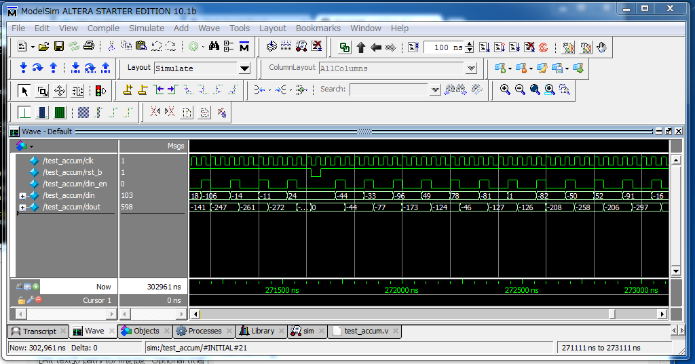

はてなダイアリーに上げるつもりだった記事だけど、なんでか文字化け起こして編集できないので、こちらに書く。

#なつたんさんにムチャ振りされたので CD-ROM を eject

もう梅の花は終わってしまった頃、でも桜にはまだだいぶ早い頃、突然、なつたんさんからメンションを頂いた。埴輪を見に博物館に出かけた帰りだった。

<blockquote class="twitter-tweet" lang="ja"><p>ブログ書いた。後は、@<a href="https://twitter.com/h_hirai">h_hirai</a> と @<a href="https://twitter.com/hiratch">hiratch</a> のひらひらコンビが「プロが書くテストベンチ」で、モダンなテストベンチの書き方を教えてくれるはず。</p>&mdash; natsutanさん (@natsutan) <a href="https://twitter.com/natsutan/status/314273682207956992">2013年3月20日</a></blockquote>
<script async src="//platform.twitter.com/widgets.js" charset="utf-8"></script>

<blockquote class="twitter-tweet" data-conversation="none" lang="ja"><p>@<a href="https://twitter.com/natsutan">natsutan</a> @<a href="https://twitter.com/h_hirai">h_hirai</a> へ？？？突然呼ばれてわけが分からん・・・</p>&mdash; KazuHiraさん (@hiratch) <a href="https://twitter.com/hiratch/status/314274157179314177">2013年3月20日</a></blockquote>
<script async src="//platform.twitter.com/widgets.js" charset="utf-8"></script>

<blockquote class="twitter-tweet" data-conversation="none" lang="ja"><p>@<a href="https://twitter.com/hiratch">hiratch</a> 素人っぽいブログ書いたので、もっと格好いい書き方があったら教えててくださいの意味です＞<a href="http://t.co/UgFO9sLzL6" title="http://d.hatena.ne.jp/natsutan/20130320">d.hatena.ne.jp/natsutan/20130…</a></p>&mdash; natsutanさん (@natsutan) <a href="https://twitter.com/natsutan/status/314274368706453504">2013年3月20日</a></blockquote>
<script async src="//platform.twitter.com/widgets.js" charset="utf-8"></script>

突然のムチャ振り! ＞＜

<blockquote class="twitter-tweet" lang="ja"><p>あー、ひらいっちのハスケルを使ったVerilog検証のブログがよみたいなー よみたいなー ちらっちらっ</p>&mdash; natsutanさん (@natsutan) <a href="https://twitter.com/natsutan/status/314302971091513346">2013年3月20日</a></blockquote>
<script async src="//platform.twitter.com/widgets.js" charset="utf-8"></script>

もはやイジメ!!  ＞＜

……このような次第で、とりあえず CD-ROM を取り出して落ち着きたい。

##C 言語で eject

わけあって、環境は Windows を使う。CD-ROM 取り出しは、何年も前に Linux でやってみたきりなので、まず、どうやったら CD-ROM を取り出せるか調べる。ぐぐると Microsoft のサポートページが見つかる。

http://support.microsoft.com/kb/165721

VisualStudio でコンパイルすれば、そのままコンパイルできるのだろうが、ここはひねくれて Cygwin の gcc を使う。TCHAR は使えないみたいなので、

* tchar.h を #include してる行をコメントアウト、
* `TCHAR` は `char` に、`_tprintf` は `printf` に置換

すればコンパイルできる。特別なオプションは必要ない。

    $ gcc -o eject eject.c
    $ ./eject d


でいける。CD-ROM ドライブがうぃんうぃんゆう。

コード → https://gist.github.com/h-hirai/5486662

##Haskell で eject

上記の C コードを少し書き換えて、Haskell の FFI で呼び出してやると、Haskell から eject できる。

* `main` と `Usage` は使わないので削除
* Haskell の関数名は小文字から始まるので `EjectVolume` を `ejectVolume` に改名 (不要かも)

FFI は初めて試してみたが、びっくりするくらい簡単に利用できる。

Haskell コードとしては以下のように、foreign import 宣言して評価するだけ。

```haskell
{-# LANGUAGE ForeignFunctionInterface #-}

main :: IO ()
main = ejectVolume 'd' >> return ()

foreign import ccall ejectVolume :: Char -> IO Bool
```

コンパイルは、C のコードといっしょくたに、

    $ ghc --make eject.hs c_eject.c

だけで、問題なく実行ファイルができる。

ほんで、

    $ ./eject

で、CD-ROM ドライブがうぃんうぃんゆう。

ドライブレターは Haskell コード内で決めうちにしてるので、指定していない。

はまった点としては、eject.hs, eject.c のように、同じファイル名にしてしまうと、オブジェクトファイル名が完全に同じになってしまうので、問題が起こる。

コード → https://gist.github.com/h-hirai/5486696

##Verilog で eject

Verilog からも C のコードを呼び出すことが出来る。そのための最新の規格は SystemVerilog の一部で、DPI-C という。これも初めて試してみたが、そこそこ簡単に動く。PLI とか VPI とかの頃は色々大変だったらしい。

DPI-C については <a href="https://sites.google.com/site/allofsystemverilog/Home/dpi-c">@Vengineer さんによる連載記事</a>が詳しい。

SystemVerilog 処理系としては、Altera が Mentor からライセンスを受けて配布している ModelSim が無料で利用できる。Linux 版と Windows 版が用意されているが、残念ながら今、手元に Linux 環境がないので Windows 版を使う。

Verilog のコードは以下:

```verilog
module v_main();
  import "DPI-C" function void ejectVolumeD();

  initial begin
    ejectVolumeD();
  end

endmodule
```

import 宣言したら、ふつうの task/function と同様に利用できる。

C コードは、DPI-C のためのヘッダファイルをインクルードする。このヘッダファイルは、Verilog コードをもとに自動生成されるので、手順として、Verilog から先にコンパイルする。

    $ vlib work
    $ vlog -sv -dpiheader dpiheader.h v_main.v

C コードは DLL としてコンパイルする。cygwin1.dll に依存させるのはいやなので (というか、実行時に依存性のエラーで落ちたので) mingw 版 gcc を使う。

    $ i686-pc-mingw32-gcc -shared -I${MODELSIM_HOME}/include -o eject.dll eject.c

CD-ROM ドライブをうぃんうぃんゆわせるには以下のとおり。

    $ vsim v_main -sv_lib eject -do 'run; quit;'

コード → https://gist.github.com/h-hirai/5486748

##Haskell の QuickCheck で Verilog のランダム試験を行う

ところで、Haskell の FFI も SystemVerilog の DPI-C も、C を呼び出すだけではなく、C から呼び出すこともできる。

なら、すごい H の田中さんのこれ → http://tanakh.jp/posts/2012-07-20-haskell-tools.html を Verilog でできるんじゃね?

ということで、まずテスト対象:

```verilog
module accum
  (input                    clk,
   input                    rst_b,
   input                    din_en,
   input signed [7:0]       din,
   output reg signed [15:0] dout
   );

  parameter signed [15:0] MaxBound = 16'sh7fff;
  parameter signed [15:0] MinBound = -16'sh7fff;

  wire signed [16:0] sum = dout + din;

  always_ff @(posedge clk or negedge rst_b)
    if (~rst_b)
      dout <= 16'h0000;
    else if (din_en)
      if (sum < MinBound)
        dout <= MinBound;
      else if (sum > MaxBound)
        dout <= MaxBound;
      else
        dout <= sum;

endmodule
```

てきとうに単純なアキュムレータにしてみた。

で、そのテストベンチ:

```verilog
module test_accum;
  timeunit 1ns;
  timeprecision 1ns;

  logic              clk;
  logic              rst_b;
  logic              din_en;
  logic signed [7:0] din;
  wire signed [15:0] dout;

  accum dut(.*);

  initial begin
    rst_b = 1'b1;
    clk = 1'b1;
    forever
      #(20ns) clk = ~clk;
  end

  import "DPI-C" context task c_main();
  initial begin
    repeat (3) @(posedge clk);
    c_main();

    $finish;
  end

  export "DPI-C" task reset;
  export "DPI-C" task v_write_data;

  task reset();
    @(negedge clk);
    rst_b = 1'b0;
    @(negedge clk);
    rst_b = 1'b1;
    @(posedge clk);
  endtask

  task v_write_data(input byte signed wr_data, inout int signed rd_data);
    @(posedge clk);
    #(1ns);
    din_en = 1'b1;
    din = wr_data;
    @(posedge clk);
    #(1ns);
    din_en = 1'b0;
    @(posedge clk);
    #(1ns);
    rd_data = dout;
  endtask

endmodule
```

* テストシナリオは、DPI-C で import する `c_main` 関数に丸投げ
* テストシナリオから、DUT を動かすためのタスク、`reset` と `v_write_data` を DPI-C で export
* `v_write_data` は、引数に渡されたデータをアキュムレータに入力した後、出力を返す

せっかく SystemVerilog なんだから、program ブロックとか clocking とか使ったらいいんじゃないかという気がするけど、そのへん不勉強でよく知らない。

丸投げされる C のほうのコードは以下:

```c
#include "dpiheader.h"

#include "HsFFI.h"

#ifdef __GLASGOW_HASKELL__
#include "hsMain_stub.h"
#endif

int write_data(char data) {
  int read_data;
  v_write_data(data, &read_data);
  return read_data;
}

int c_main(void) {
  hs_init(0, 0);
  hsMain();
  hs_exit();

  return 0;
}
```

* `c_main` は、Haskell の FFI で export される `hsMain` にたらいまわし
* DPI-C で export される `v_write_data` は、出力データをポインタで経由で受け渡しする形になるので、これを返り値で返すように `write_data` でラップ
* `reset` はそのままで Haskell から呼ばれる

最後に Haskell のコード:

```haskell
{-# LANGUAGE ForeignFunctionInterface #-}

module HsMain where

import Test.QuickCheck
import Test.QuickCheck.Property
import Data.Int (Int8, Int16)
import Data.List (inits)

prop_Accum :: [Int8] -> Property
prop_Accum integers = morallyDubiousIOProperty $ do
  reset
  actuals <- mapM write_data integers
  return $ actuals == expects
  where expects = map sum $ tail $ map (map fromIntegral) $ inits integers

hsMain :: IO ()
hsMain = quickCheck prop_Accum

foreign export ccall hsMain :: IO ()
foreign import ccall reset :: IO ()
foreign import ccall write_data :: Int8 -> IO Int16
```

QuickCheck によって生成された乱数リスト `integers` に対し、`mapM write_data` することで、乱数をアキュムレータにひとつずつ入力して、それにより変化した出力をリストにして `actuals` に束縛、これを `expects` と比較している。

`hsMain` は、プロパティ `prop_Accum` に対して、`quickCheck` を適用しているだけ。

コンパイル手順は以下のとおり。

CD-ROM ドライブをうぃんうぃんゆわせたときと同様、まず、Verilog のコードからコンパイルする。DPI-C で import するだけの場合とは異なり、`vsim -dpiexportobj` でオブジェクトファイルも生成する必要がある。

    $ vlib work
    $ vlog -sv -dpiheader dpiheader.h test_accum.v accum.v
    $ vsim -dpiexportobj exportobj test_accum

C のコードは ghc が生成するヘッダファイルも #include するので、次に、Haskell のコードからコンパイルする。それから C のコードをコンパイルするが、これも ghc でコンパイルする。gcc でなく ghc を使うのは、ghc が FFI 関連ヘッダファイルやライブラリの在処を知ってて、指定してやる必要がなくなるから。

ここではまったのは、ghc は Haskell Platform の Windows 用インストーラで入れたもののため、Cygwin 形式のパスを解釈できないということ。cygpath コマンドの -m オプションなどで変換するとよい。

    $ ghc -c hsMain.hs
    $ ghc -c -I"${MODELSIM_HOME}/include" c_main.c

最後に、すべてのオブジェクトファイルをリンクして DLL ファイルを作る。

    $ ghc -shared -L$"${MODELSIM_HOME}/win32aloem" -o main.dll exportobj.obj c_main.o hsMain.o -lmtipli -package QuickCheck

DPI-C のために `-lmtipli` オプションをつける。また、QuickCheck は、Haskell Platform を入れれば同時にインストールされるものの外部ライブラリ扱いなので `-package QuickCheck` をつける。

DLL が無事できたら、以下のように実行できる。

    $ vsim test_accum -sv_lib main -do 'run -all'
    Reading C:/altera/12.1sp1/modelsim_ase/tcl/vsim/pref.tcl
    
    # 10.1b
    
    # vsim -do {run -all} -sv_lib main test_accum
    # Loading C:\cygwin\tmp\hirai@MACBOOKPRO_dpi_1992\win32pe_gcc-4.2.1\export_tramp.dll
    # Loading sv_std.std
    # Loading work.test_accum
    # Loading work.accum
    # Compiling C:\cygwin\tmp\hirai@MACBOOKPRO_dpi_1992\win32pe_gcc-4.2.1\exportwrapper.c
    # Loading C:\cygwin\tmp\hirai@MACBOOKPRO_dpi_1992\win32pe_gcc-4.2.1\dpi_auto_compile.dll
    # Loading .\main.dll
    # run -all
    +++ OK, passed 100 tests.
    # ** Note: $finish    : test_accum.v(25)
    #    Time: 286521 ns  Iteration: 0  Instance: /test_accum

100 件のテストが生成されて、パスしてることが分かる。

といっても、これだけでは、なにが動いてるのか分からないので、GUI を起動して波形を出力してみると、こんな感じになる。



実際には、アキュムレータは飽和するように作ってあるのに対して、QuickCheck のプロパティはそこを考慮していないのだが、デフォルトでは、そこにひっかかるケースまでは生成してくれないようだ。

##補足

* そもそも、ランダムテストのための制約付き乱数生成は、SystemVerilog の目玉機能だったりするので、Verilog でランダムテストをしたいなら、そっちを使うのが普通だと思う
* 田中Hさんの元ネタでは、cabal コマンドを使用して、いろいろ素敵に自動化されているが、テスト対象が Verilog になると、どうしても Verilog シミュレータから Haskell を呼び出す形にせざるを得ないため、同じようには出来なかった
    * なにかうまいテがあったら教えてくだしあ
* SystemC の DUT を想定したら、も少し有意義な記事になったかもしんない
    * しかし、これも main は SystemC 側につかまれてる……

プロは、こんなアホなことは、しない、きっと。
